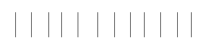
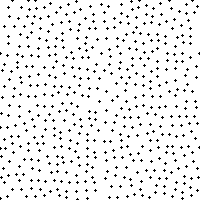

<p align="center">

<br>


<a href="https://pkg.go.dev/github.com/kelindar/noise"></a>
<a href="https://goreportcard.com/report/github.com/kelindar/noise"></a>
<a href="https://opensource.org/licenses/MIT"></a>
<a href="https://coveralls.io/github/kelindar/noise"></a>
</p>

## Procedural Generation Methods

This package provides **noise generation** and **sparse point sampling** algorithms for Go, focusing on speed and deterministic output. It includes both classic noise functions and advanced sparse sampling techniques for procedural generation, simulations, and spatial applications. I built this primarily with offline procedural generation in mind.


**Use When:**
- ✅ Generating procedural terrain, textures, or patterns
- ✅ Creating well-spaced point distributions for sampling or placement
- ✅ Needing high-throughput noise generation for real-time applications
- ✅ Requiring deterministic, reproducible random patterns

**Not For:**
- ❌ Cryptographic randomness or security-sensitive applications
- ❌ True Poisson-disk sampling (this implements SSI, which is faster but different)


## Simplex Noise
Classic simplex noise for smooth procedural generation.

<p align="center">

<br><em>1D simplex noise pattern</em>
</p>

<p align="center">

<br><em>2D simplex noise pattern</em>
</p>

<p align="center">

<br><em>3D simplex noise animation</em>
</p>

```go
// Create a simplex noise generator
s := noise.NewSimplex(12345)

// Generate 1D, 2D, or 3D noise
value1D := s.Eval(10.5)
value2D := s.Eval(10.5, 20.3)
value3D := s.Eval(10.5, 20.3, 30.1)
```

## Fractal Brownian Motion (fBM)
Multi-octave noise for complex patterns.

<p align="center">

<br><em>1D fractal Brownian motion</em>
</p>

<p align="center">

<br><em>2D fractal Brownian motion</em>
</p>

<p align="center">

<br><em>3D fractal Brownian motion animation</em>
</p>

```go
// Create an fBM generator
fbm := noise.NewFBM(12345)

// Generate fractal noise with lacunarity=2.0, gain=0.5, octaves=4
value1D := fbm.Eval(2.0, 0.5, 4, 10.5)
value2D := fbm.Eval(2.0, 0.5, 4, 10.5, 20.3)
value3D := fbm.Eval(2.0, 0.5, 4, 10.5, 20.3, 30.1)
```

## White Noise
Generate deterministic white noise in [-1, 1] range.

<p align="center">

<br><em>1D white noise pattern</em>
</p>

<p align="center">

<br><em>2D white noise pattern</em>
</p>

```go
// 1D white noise
value := noise.White(12345, 10.5)

// 2D white noise
value := noise.White(12345, 10.5, 20.3)

// 3D white noise
value := noise.White(12345, 10.5, 20.3, 30.1)

// N-dimensional white noise
value := noise.White(12345, 1.0, 2.0, 3.0, 4.0, 5.0)
```


## Basic Random Values

Generate deterministic random values based on seed and input coordinates.

```go
const seed = uint32(12345)
const x = uint64(42) // Input coordinate/hash

// Float values in [0.0, 1.0)
f32 := noise.Float32(seed, x)
f64 := noise.Float64(seed, x)

// Integer values
i := noise.Int(seed, x)
i32 := noise.Int32(seed, x)
i64 := noise.Int64(seed, x)
u := noise.Uint(seed, x)

// Normal distribution (Box-Muller)
norm32 := noise.Norm32(seed, x)
norm64 := noise.Norm64(seed, x)
```

## Bounded Random Values

```go
// Random integers in [0, n)
i := noise.IntN(seed, 100, x)        // [0, 100)
i32 := noise.Int32N(seed, 50, x)     // [0, 50)
i64 := noise.Int64N(seed, 1000, x)   // [0, 1000)
u32 := noise.Uint32N(seed, 256, x)   // [0, 256)
u64 := noise.Uint64N(seed, 512, x)   // [0, 512)
u := noise.UintN(seed, 128, x)       // [0, 128)

// Random integers in [a, b] (inclusive)
i := noise.IntIn(seed, 10, 20, x)       // [10, 20]
i32 := noise.Int32In(seed, -5, 5, x)    // [-5, 5]
i64 := noise.Int64In(seed, 100, 200, x) // [100, 200]
u32 := noise.Uint32In(seed, 50, 100, x) // [50, 100]
u64 := noise.Uint64In(seed, 0, 255, x)  // [0, 255]
u := noise.UintIn(seed, 1, 10, x)       // [1, 10]
```

## Probability Functions

```go
// Roll dice - returns true if random value < probability
success32 := noise.Roll32(seed, 0.3, x) // 30% chance
success64 := noise.Roll64(seed, 0.75, x) // 75% chance
```


The package provides Simple Sequential Inhibition (SSI) algorithms for generating well-spaced point distributions. These are ideal for procedural placement, sampling, and avoiding clustering artifacts.

<p align="center">

<br><em>1D sparse point distribution</em>
</p>

## 1D Sparse Points

```go
// Generate 1D points with minimum distance of 1.0 unit
for x := range noise.SSI1(12345, 128) {
    fmt.Printf("Point at x=%.2f\n", x)
}

// Generate integer positions with custom spacing
for ix := range noise.Sparse1(12345, 512, 8) {
    fmt.Printf("Pixel at x=%d\n", ix)
}
```

<p align="center">

<br><em>2D sparse point distribution</em>
</p>

## 2D Sparse Points

```go
// Generate 2D points with minimum distance of 1.0 unit
for pt := range noise.SSI2(12345, 64, 64) {
    x, y := pt[0], pt[1]
    fmt.Printf("Point at (%.2f, %.2f)\n", x, y)
}

// Generate integer positions for pixel placement
for pt := range noise.Sparse2(12345, 512, 256, 8) {
    x, y := pt[0], pt[1]
    fmt.Printf("Pixel at (%d, %d)\n", x, y)
}
```

## Performance

Benchmarks run on 13th Gen Intel(R) Core(TM) i7-13700K CPU. Results may vary based on hardware and environment.

```
name                 time/op      ops/s        allocs/op   
-------------------- ------------ ------------ ------------
simplex 1D (seq)     15.9 ns      62.9M        0           
simplex 1D (rnd)     16.0 ns      62.6M        0           
simplex 2D (seq)     12.9 ns      77.7M        0           
simplex 2D (rnd)     16.5 ns      60.7M        0           
simplex 3D (seq)     22.6 ns      44.3M        0           
simplex 3D (rnd)     28.6 ns      34.9M        0           
fbm 1D (seq)         49.1 ns      20.4M        0           
fbm 1D (rnd)         51.5 ns      19.4M        0           
fbm 2D (seq)         43.0 ns      23.3M        0           
fbm 2D (rnd)         54.9 ns      18.2M        0           
fbm 3D (seq)         71.6 ns      14.0M        0           
fbm 3D (rnd)         105.3 ns     9.5M         0           
white 1D (seq)       6.2 ns       161.6M       0           
white 1D (rnd)       6.1 ns       163.4M       0           
white 2D (seq)       8.9 ns       112.6M       0           
white 2D (rnd)       8.9 ns       112.5M       0           
white 3D (seq)       12.2 ns      81.7M        0           
white 3D (rnd)       12.2 ns      82.2M        0           
sparse 1D            620.4 ns     1.6M         1           
sparse 2D            25.9 µs      38.6K        1           
ssi 1D               5.5 µs       181.2K       1           
ssi 2D               2.2 ms       446          1           
float                3.8 ns       261.6M       0           
int n                3.8 ns       259.8M       0           
norm                 27.7 ns      36.1M        0           
int in               4.4 ns       226.4M       0           
roll                 3.8 ns       260.8M       0           
```


## Contributing

We are open to contributions, feel free to submit a pull request and we'll review it as quickly as we can. This library is maintained by [Roman Atachiants](https://www.linkedin.com/in/atachiants/)

## License

This project is licensed under the [MIT License](LICENSE.md).
